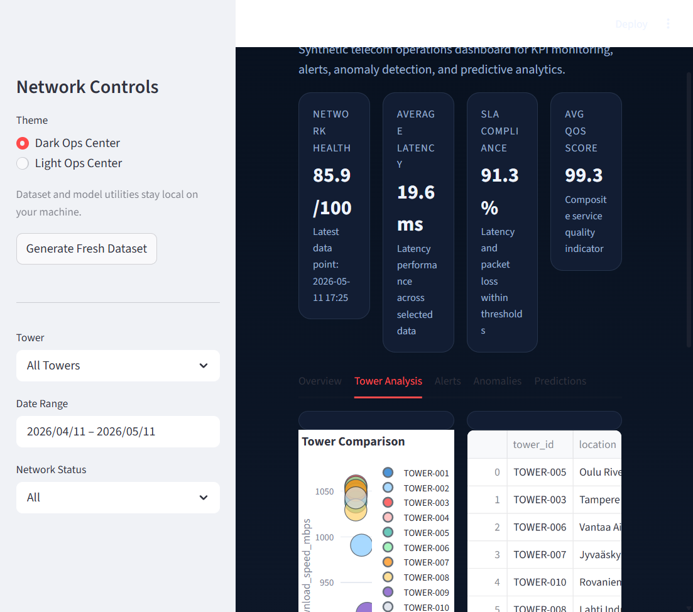
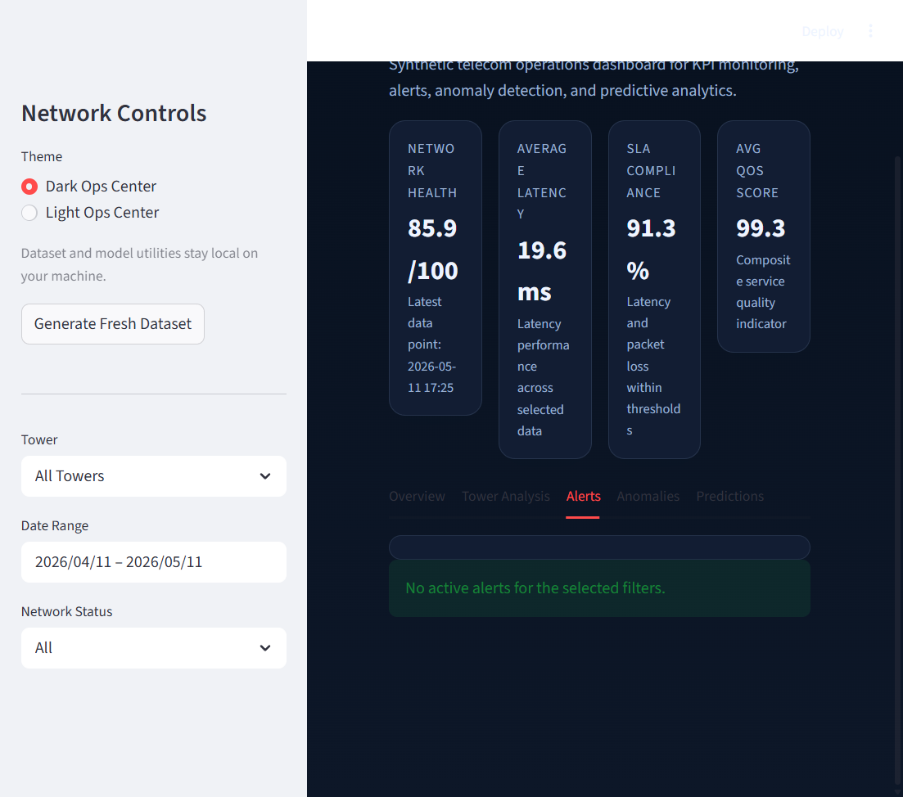
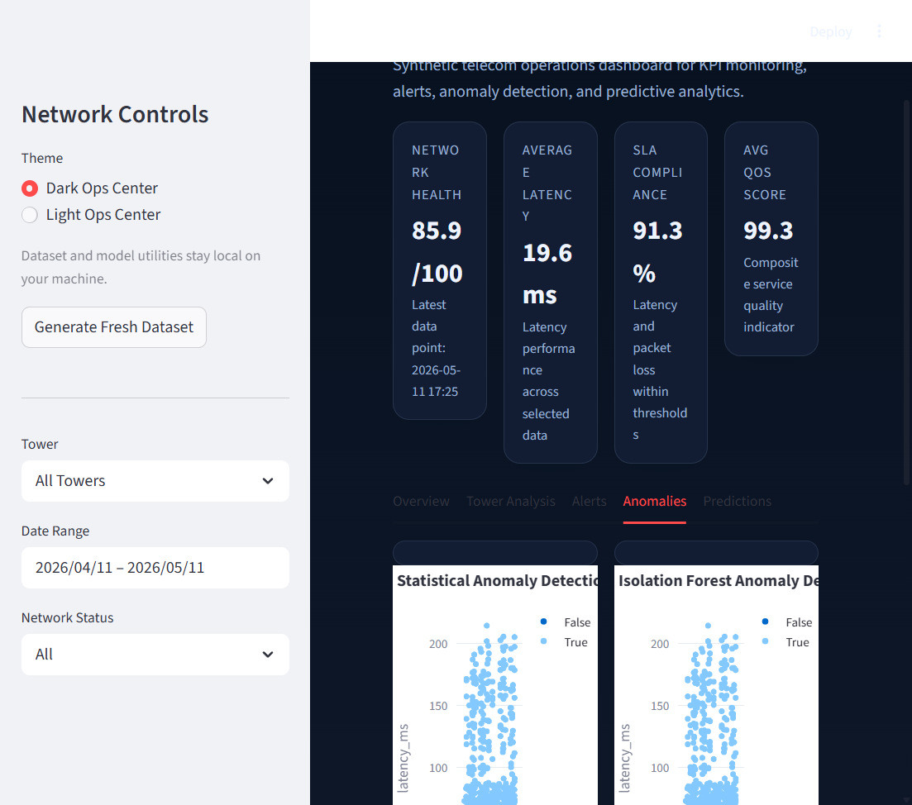
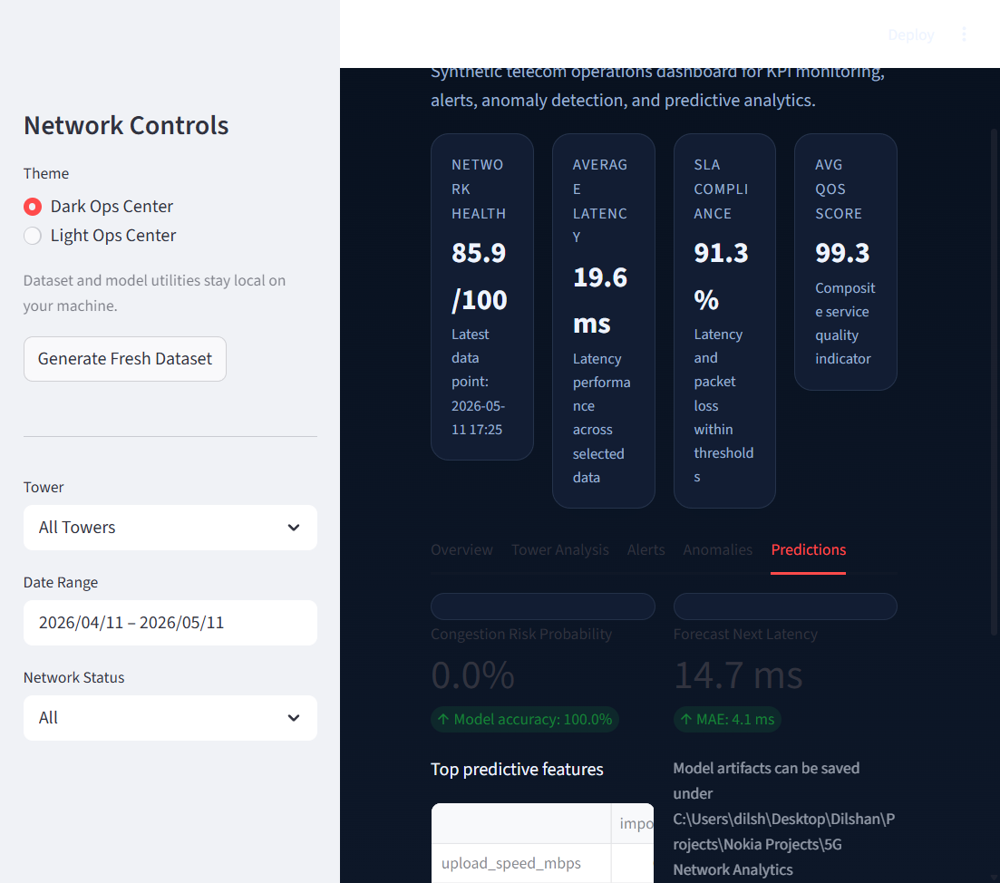

# 5G Network Analytics Dashboard

Local telecom operations dashboard built with Python and Streamlit. It simulates a realistic 5G network so you can demonstrate KPI monitoring, analytics, alerting, anomaly detection, and basic ML without needing external services or proprietary data.

## Why This Project Works For Recruiters

- Shows end-to-end product thinking, from synthetic data generation to dashboard delivery.
- Uses realistic telecom metrics such as latency, packet loss, signal strength, congestion, availability, and QoS.
- Demonstrates practical analytics skills that map directly to network operations and telecom data roles.
- Runs fully on localhost with only free and open-source tools.

## Tech Stack

- Python
- Streamlit
- Pandas
- NumPy
- Plotly
- scikit-learn
- Optional local storage in CSV, with SQLite ready for a future phase

## Features

- Synthetic 5G tower dataset with 10 towers and 30 days of 5-minute samples.
- Realistic traffic patterns, peak-hour congestion, outages, and signal degradation.
- Interactive dashboard with tower and date filters.
- KPI cards for network health, latency, SLA compliance, and QoS.
- Visualizations for latency, throughput, signal strength, packet loss, tower comparison, and congestion heatmaps.
- Alert rules for high latency, weak signal, packet loss, congestion, and outages.
- Statistical and Isolation Forest anomaly detection.
- Lightweight predictive analytics for congestion risk and latency forecasting.

## Screenshots

### Overview


### Tower Analysis



### Alerts



### Anomalies



### Predictions



## Project Structure

```text
5g-network-dashboard/
├── app.py
├── requirements.txt
├── README.md
├── data/
├── src/
│   ├── data_generation/
│   ├── analytics/
│   ├── alerts/
│   ├── visualizations/
│   └── utils/
├── screenshots/
├── notebooks/
└── models/
```

## Local Setup

### 1. Create a virtual environment

```powershell
python -m venv .venv
.\.venv\Scripts\Activate.ps1
```

### 2. Install dependencies

```powershell
pip install -r requirements.txt
```

### 3. Run the dashboard

```powershell
streamlit run app.py
```

The app runs locally at `http://localhost:8501`.

## Telecom Concepts Used

- Latency: how long packets take to cross the network.
- Packet loss: how many packets fail to arrive.
- Signal strength: radio quality from the tower.
- Congestion: how heavily loaded a tower is.
- Availability: whether the network is up and usable.
- QoS: a combined service quality indicator.

## Analytics Included

- KPI aggregation by tower and time range.
- Tower performance ranking.
- Peak-hour behavior analysis.
- Congestion analysis.
- Network health scoring.
- SLA compliance calculation.

## Anomaly Detection

The dashboard includes two approaches:

- Statistical z-score detection for fast outlier spotting.
- Isolation Forest for a simple ML-based anomaly check.

This matters in telecom because it helps surface failures, unstable links, and hidden congestion before customer impact becomes visible.

## Predictive Analytics

The ML section is intentionally lightweight and local:

- congestion risk prediction
- latency forecasting

That keeps the project beginner-friendly while still showing awareness of applied machine learning in operations.

## Business Value

This project is a strong portfolio piece for internships, graduate roles, analytics roles, and telecom interviews because it shows:

- data generation and feature design
- dashboard development
- KPI monitoring
- alerting logic
- anomaly detection
- practical ML basics

## GitHub Prep Checklist

- The screenshots folder already contains images captured from the running app.
- Keep commits focused by phase: data, analytics, UI, docs.
- Use the README as your portfolio summary and demo entry point.
- Pin a short project description on GitHub and link to the dashboard screenshots.

## Suggested LinkedIn Summary

I built a local 5G Network Analytics Dashboard in Python and Streamlit that simulates telecom tower KPIs, detects congestion and anomalies, and presents operational insights through interactive charts and alerts.

## Future Improvements

- Persist alert history in SQLite.
- Add scheduled dataset refresh.
- Expand tower-level drill-down to sector/cell granularity.
- Add export to Excel or PDF.
- Improve forecasting with time-series models.